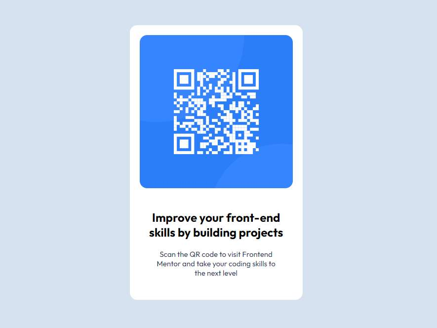

# Frontend Mentor - QR code component solution

This is a solution to the [QR code component challenge on Frontend Mentor](https://www.frontendmentor.io/challenges/qr-code-component-iux_sIO_H). Frontend Mentor challenges help you improve your coding skills by building realistic projects. 

## Table of contents

- [Overview](#overview)
  - [Screenshot](#screenshot)
  - [Links](#links)
- [My process](#my-process)
  - [Built with](#built-with)
  - [What I learned](#what-i-learned)
  - [Continued development](#continued-development)
- [Author](#author)

## Overview

### Screenshot

### Links

- Solution URL: [GitHub](https://github.com/MaryTreasure/Frontend-Mentor-QR-code-component-solution)
- Live Site URL: [Frontend-Mentor-QR-code-component-solution](https://frontend-mentor-qr-code-component-solution-seven.vercel.app/)

## My process

### Built with

- Semantic HTML5 markup
- CSS custom properties
- Flexbox

### What I learned

I learned how to write html, css, and use flexbox.

### Continued development

Next, I'm going to practice layout and learn React in more detail

## Author

- Website - [Mary Treasure](https://github.com/MaryTreasure)
- Frontend Mentor - [@MaryTreasure](https://www.frontendmentor.io/profile/MaryTreasure)

